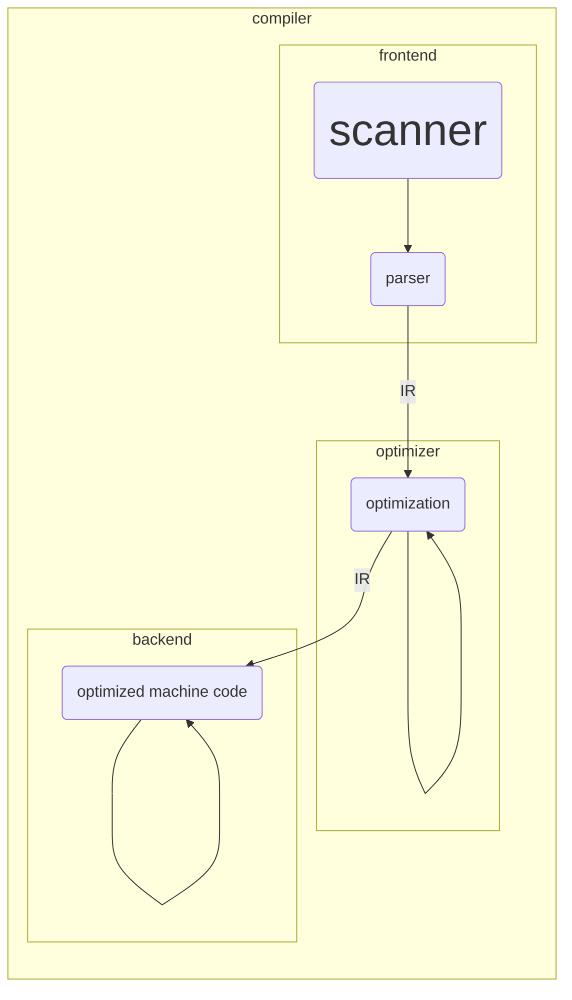

# Lecture 1

## Logistics

Course | Compiler Design - COMP 304
---|----
Webpage| https://github.com/m-fakhry/comp304-2022
Structure | 2 hours lecture and 2 hours lab
Grades | 90 (final), 23 (midterm and exam), 37 (lab)
Book | "_Compilers - Principles, Techniques, and Tools_", Alfred Aho, Monica Lam, Ravi Sethi, Jeffrey Ullman, 2007
Objective | Design and Implement compilers
Skills | programming languages, machine architecture, language theory, algorithms, and software engineering.
Tool |  ANTLR https://www.antlr.org/

---

## Compiler

- What is a complier?
  - Compilers are large, complex, carefully engineered objects. It must
    - preserve the meaning of the program being compiled.
    - improve the input program in some discernible way

```mermaid
%%{init: {'themeVariables': {'fontSize':'20px', 'fontFamily': 'verdana'}}}%%
  graph LR; %% left to right
    s(Source Program)--> Compiler --> T(Target Code);
    i(Input)--> T --> o(Output);
```

- What is an interpreter?

```mermaid
  graph LR; %% left to right
      s(Source Program)--> c(Interpreter) ;
      c --> o(Output);
      i(Input)--> c;
```

- Complier vs Interpreter
    - running time, code generation, errors, etc.

- Examples: text to figure, html to latex, high-level language to low-level language, etc.

- Why study compiler?

---

## Compiler Structure



- **scanner**: identifies distinct words
in the input program and to classify each word
- **parser**: derives the output and generates annotated parse tree.
- **intermediate representation (IR)**: Some IRs represent the program as a graph. Others resemble a sequential assembly code program.
- **optimizer**: discovers facts about that context of the code to rewrite the code in a more efficient way
- **back-end**: emits code for the target machine
