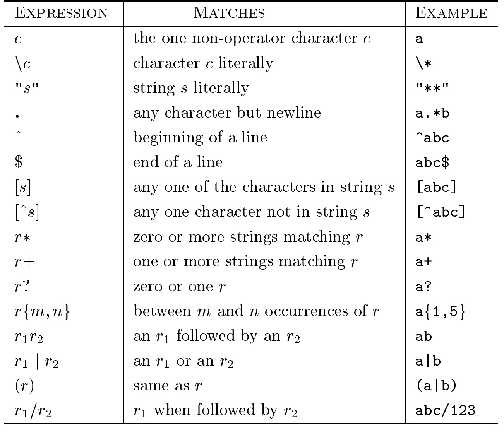
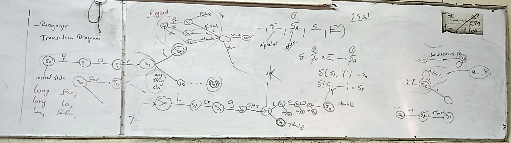

# Lecture 2

## Scanner

- Definition of scanner: stream of characters to a stream of tokes
- Scanner (Lexical Analysis) Versus Parsing
- Recognition of Tokens ... recognize each word ... word by word  
  - Example:
    convert the stream of characters
    <section>
      <pre><code data-trim data-noescape>
        for(i=0; i<5; i++){
        }
      </code></pre>
    </section>
    to
    <section>
      <pre><code data-trim data-noescape>
        < for_iteration >
        < open_paranthesis >
        < identifier, i >
        < assignment >
        < number, 2 >
        ...
      </code></pre>
    </section>
- Transition Diagram
- Finite Automata
  - deterministic (DFA) and non-deterministic (NFA)
- How to handle a keyword when dealing with identifier
- Regular expression
  
- Very high level of different ways of implementing a scanner
  - hand-coded
  - table-driven
  - direct-coded

- Picture for the lecture

<!-- - **Exercise**

- Input Buffering
- Regular Expressions
  - Exercise: Exercise 3.3.2 : Describe the languages denoted by the following regular expressions
- Recognition of Tokens
  - Transition Diagram
- Finite Automata
  - DFA and NFA
  - NFA to DFA
  - Regular Expression to NFA
  - Regular Expression directly to DFA
 -->

  <section>
    <pre><code data-trim data-noescape>
    </code></pre>
  </section>
