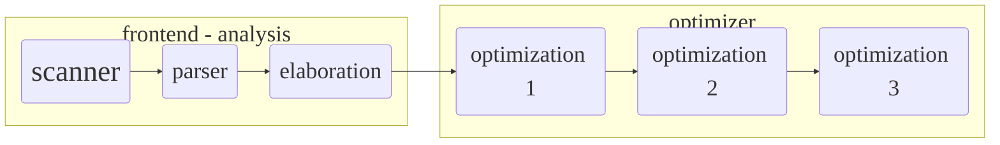

<style>
    .reveal .slides {
        text-align: left;
        font-size: 1.3em;
        position: absolute;
        top: 0;
        left: 0;
        padding: 0px;
    }
    .reveal p:first-child { margin-top: 0px; }
    .reveal .slides > section { padding: 0px; }
    .reveal div.slides { position: absolute; top: -5%; }
</style>

<script>mermaid.initialize({startOnLoad:true});</script>

## Lecture 1

---
## Logistics

Course | Compiler Design - COMP 304
---|----
Structure | 2 hours lecture and 2 hours lab
Grades | 90 (final), 23 (midterm and exam), 37 (lab)
Book | "_Compilers - Principles, Techniques, and Tools_", 2007
Objective | Design and Implement compilers
Skills | programming languages, machine architecture, language theory, algorithms, and software engineering.
Tool |  ANTLR https://www.antlr.org/

---
## Compiler

- What is a complier?

<!-- https://mermaid-js.github.io/mermaid/#/theming -->

```mermaid
%%{init: {'themeVariables': {'fontSize':'35px', 'fontFamily': 'verdana'}}}%%
  graph LR; %% left to right
    s(Source Program)--> Compiler --> T(Target Code);
    i(Input)--> T --> o(Output);
```

- What is an interpreter?

```mermaid
%%{init: {'themeVariables': { 'fontSize': '35px', 'fontFamily': 'verdana'}}}%%
  graph LR; %% left to right
      s(Source Program)--> c(Interpreter) ;
      c --> o(Output);
      i(Input)--> c;
      classDef bigger font-size:45
      class s,c bigger
```

- Complier vs Interpreter
    - running time, code generation, errors, etc.


---
## Compiler Structure


<!-- lexical, syntax, semantics, intermediate representation, optimization, code generation,-->
---

<section>
  <pre>
  <code data-trim data-noescape data-line-numbers="1-2|3-4">
  class Test {
    public int main(){
      pass
    }
  }
  </code>
  </pre>
</section>

---
